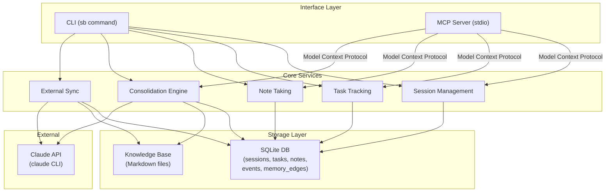
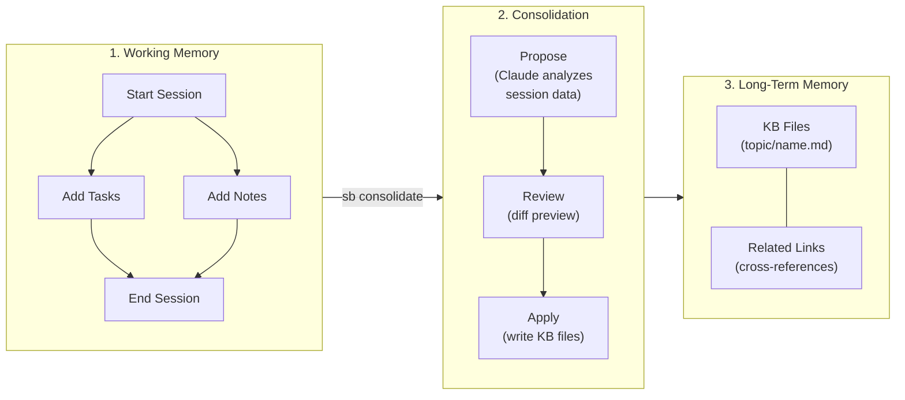
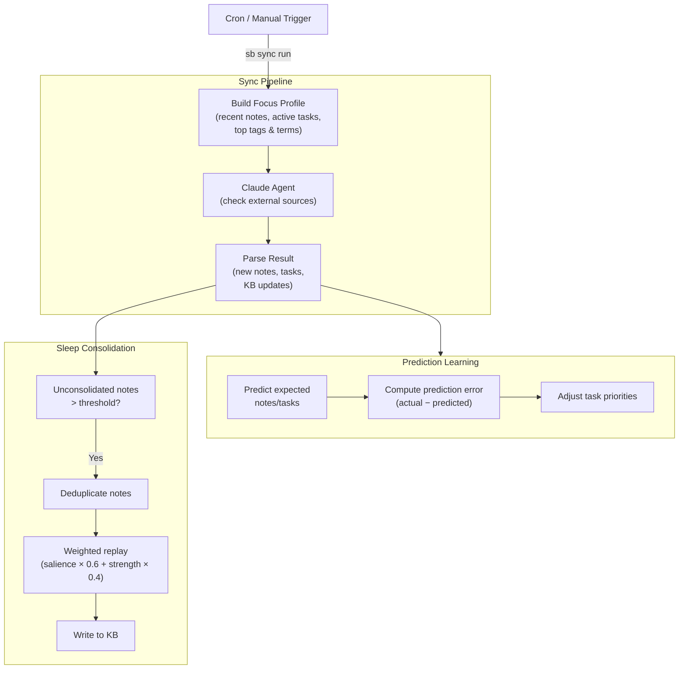

# second-brain

[日本語](docs/README.ja.md)

A personal knowledge management CLI that captures work sessions, tasks, notes, and long-term knowledge. Includes an MCP server for seamless Claude Code integration.

## Architecture

### System Overview



### Data Flow: Capture → Consolidation → Knowledge



### Sync & Learning Loop



## Features

- **Session Management** — Track focused work sessions with goals and summaries
- **Task Tracking** — Create, prioritize, and manage tasks within sessions
- **Note Taking** — Capture insights with tags and source attribution
- **Knowledge Base** — Persistent markdown files organized by topic
- **Session Consolidation** — AI-powered extraction of session knowledge into the KB
- **External Sync** — Periodic collection of information from external sources
  with adaptive relevance prioritization learned from saved notes/tasks
- **MCP Server** — Expose all capabilities to Claude Code via Model Context Protocol

## Installation

```bash
# From source
go install github.com/urugus/second-brain@latest

# Or build locally
git clone https://github.com/urugus/second-brain.git
cd second-brain
make build
# Binary: ./sb
```

## Quick Start

```bash
# Start a work session
sb session start "Implement auth module" --goal "Add JWT authentication"

# Track tasks
sb task add "Design token schema" --priority 2
sb task add "Write middleware" --priority 3

# Capture notes
sb note add "JWT RS256 is preferred for microservices" --tags jwt,security

# Mark progress
sb task done 1

# End the session
sb session end --summary "Completed schema design, middleware in progress"

# Consolidate knowledge into the KB
sb consolidate
```

## CLI Reference

### session

| Command | Description | Flags |
|---------|-------------|-------|
| `session start <title>` | Start a new work session | `--goal` |
| `session end` | End the active session | `--summary` |
| `session list` | List sessions | `--status` (active/completed/abandoned) |
| `session show <id>` | Show session details with tasks and notes | |

### task

| Command | Description | Flags |
|---------|-------------|-------|
| `task add <title>` | Add a new task | `--desc`, `--priority` (0-3), `--session` |
| `task list` | List tasks | `--status` (todo/in_progress/done/cancelled), `--session` |
| `task update <id>` | Update a task | `--title`, `--desc`, `--status`, `--priority` |
| `task done <id>` | Mark task as done | |

### note

| Command | Description | Flags |
|---------|-------------|-------|
| `note add <content>` | Add a note (use `-` to read from stdin) | `--tags`, `--source`, `--session` |
| `note list` | List notes | `--session`, `--tag` |
| `note show <id>` | Show full note details | |
| `note recall <id>` | Recall a note to reinforce memory strength | |
| `note related <id>` | Show related notes from memory edges | `--depth`, `--limit` |
| `note link <from-id> <to-id>` | Create/reinforce a directed memory edge | `--weight`, `--evidence` |

### kb

| Command | Description |
|---------|-------------|
| `kb list` | List all knowledge base files |
| `kb show <path>` | Display a KB file |
| `kb search <query>` | Search KB files |

### consolidate

Consolidate a completed session's knowledge into the KB using AI.

```bash
sb consolidate                    # Latest unconsolidated session
sb consolidate --session 3        # Specific session
sb consolidate --dry-run          # Preview without applying
sb consolidate --yes              # Auto-approve all changes
sb consolidate --model claude-sonnet-4-5-20250514  # Specify model
```

### sync

| Command | Description | Flags |
|---------|-------------|-------|
| `sync run` | Execute sync now | `--model` |
| `sync enable` | Enable automatic sync | `--interval` (default: 30m) |
| `sync disable` | Disable automatic sync | |
| `sync status` | Show sync status | |
| `sync log` | Show sync history | `--limit` (default: 10) |
| `sync metrics` | Show operational KPIs | `--days` (default: 14) |

### Other

| Command | Description |
|---------|-------------|
| `mcp serve` | Start MCP server on stdio |
| `version` | Print version |

### Global Flags

| Flag | Default | Description |
|------|---------|-------------|
| `--db` | `~/.second-brain/brain.db` | SQLite database path |
| `--kb-dir` | `~/.second-brain/knowledge` | Knowledge base directory |

## Runtime Parameters

Tune behavior with environment variables:

- `SB_SLEEP_THRESHOLD`
- `SB_SYNC_PREDICTION_WINDOW`
- `SB_PRIORITY_ADJUST_LIMIT`
- `SB_TASK_PRIORITY_MAX`
- `SB_SLEEP_REPLAY_ALPHA`
- `SB_SLEEP_DUPLICATE_REPLAY_WEIGHT`
- `SB_METRICS_WINDOW_DAYS`
- `SB_SYNC_FOCUS_NOTES_LIMIT`
- `SB_SYNC_FOCUS_TASKS_LIMIT`
- `SB_SYNC_FOCUS_TAGS_MAX`
- `SB_SYNC_FOCUS_TERMS_MAX`

Feature flags for rollback:

- `SB_FEATURE_PREDICTION_LEARNING=0|1`
- `SB_FEATURE_SLEEP_REPLAY=0|1`
- `SB_FEATURE_SYNC_FOCUS_LEARNING=0|1`

Details: [Phase 5 operations playbook](docs/phase5-operations-playbook.ja.md)

## MCP Server

The MCP server exposes 18 tools for Claude Code integration.

### Setup

```bash
claude mcp add second-brain -- /path/to/sb mcp serve
```

### Available Tools

| Category | Tools |
|----------|-------|
| Session | `get_active_session`, `list_sessions`, `start_session`, `end_session` |
| Task | `create_task`, `list_tasks`, `update_task_status` |
| Note | `create_note`, `list_notes`, `recall_note`, `related_notes`, `link_notes` |
| Knowledge Base | `kb_list`, `kb_read`, `kb_search`, `kb_write` |
| Event | `list_events` |
| Consolidation | `consolidate` (modes: propose / apply) |

Tasks and notes created via MCP auto-attach to the active session.

## Development

```bash
make build      # Build local binary
make test       # Run all tests
make lint       # Run static checks (go vet)
make build-all  # Cross-build for darwin/linux (amd64/arm64)
make clean      # Remove build artifacts
```

### Project Structure

```
cmd/                   CLI command definitions
internal/
  model/               Domain models
  store/               SQLite persistence and migrations
  kb/                  Knowledge base file operations
  mcp/                 MCP server and tool handlers
  consolidation/       AI-powered session consolidation
  sync/                External source sync service
  adapter/claude/      Claude API adapter
```
