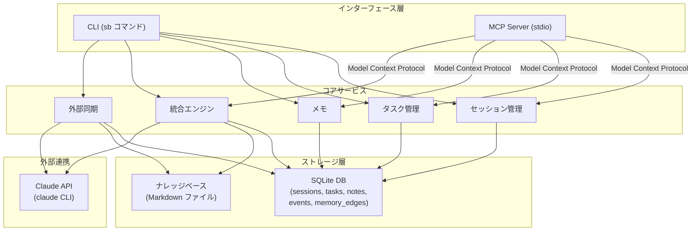
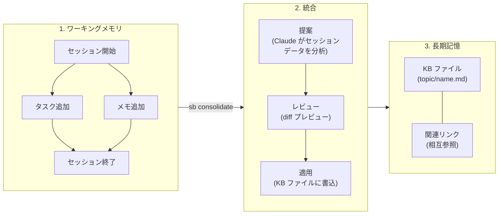
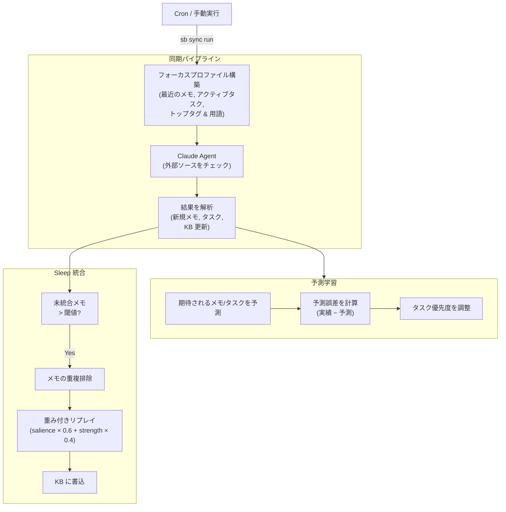

# second-brain

作業セッション、タスク、メモ、長期的なナレッジを管理するパーソナルナレッジマネジメント CLI。Claude Code との連携用 MCP サーバーを内蔵。

## アーキテクチャ

### システム全体像



### データフロー: キャプチャ → 統合 → ナレッジ



### Sync & 学習ループ



## 機能

- **セッション管理** — ゴールとサマリー付きの作業セッションを記録
- **タスク管理** — セッション内でタスクの作成・優先度設定・管理
- **メモ** — タグやソース情報付きでインサイトを記録
- **ナレッジベース** — トピック別に整理された永続的な Markdown ファイル
- **セッション統合** — AI によるセッション知識の KB への抽出
- **外部同期** — 外部ソースからの定期的な情報収集
  （保存済みノート/タスクから学習して関連性を優先）
- **MCP サーバー** — Model Context Protocol で全機能を Claude Code に公開

## インストール

```bash
# ソースから
go install github.com/urugus/second-brain@latest

# ローカルビルド
git clone https://github.com/urugus/second-brain.git
cd second-brain
make build
# バイナリ: ./sb
```

## クイックスタート

```bash
# 作業セッションを開始
sb session start "認証モジュールの実装" --goal "JWT認証を追加"

# タスクを追跡
sb task add "トークンスキーマの設計" --priority 2
sb task add "ミドルウェアの実装" --priority 3

# メモを記録
sb note add "マイクロサービスではJWT RS256が推奨" --tags jwt,security

# 進捗を更新
sb task done 1

# セッションを終了
sb session end --summary "スキーマ設計完了、ミドルウェアは進行中"

# ナレッジをKBに統合
sb consolidate
```

## CLI リファレンス

### session

| コマンド | 説明 | フラグ |
|---------|------|-------|
| `session start <title>` | 新しいセッションを開始 | `--goal` |
| `session end` | アクティブなセッションを終了 | `--summary` |
| `session list` | セッション一覧 | `--status` (active/completed/abandoned) |
| `session show <id>` | セッション詳細（タスク・メモ含む） | |

### task

| コマンド | 説明 | フラグ |
|---------|------|-------|
| `task add <title>` | タスクを追加 | `--desc`, `--priority` (0-3), `--session` |
| `task list` | タスク一覧 | `--status` (todo/in_progress/done/cancelled), `--session` |
| `task update <id>` | タスクを更新 | `--title`, `--desc`, `--status`, `--priority` |
| `task done <id>` | タスクを完了にする | |

### note

| コマンド | 説明 | フラグ |
|---------|------|-------|
| `note add <content>` | メモを追加（`-` で stdin から読み込み） | `--tags`, `--source`, `--session` |
| `note list` | メモ一覧 | `--session`, `--tag` |
| `note show <id>` | メモの詳細表示 | |
| `note recall <id>` | メモを想起して記憶強度を補強 | |
| `note related <id>` | memory edge に基づく関連メモを表示 | `--depth`, `--limit` |
| `note link <from-id> <to-id>` | 有向 memory edge を作成/強化 | `--weight`, `--evidence` |

### entity

| コマンド | 説明 | フラグ |
|---------|------|-------|
| `entity list` | 学習済み entity を一覧表示 | `--note`, `--kind`, `--status`, `--limit` |
| `entity show <id>` | entity の詳細を表示 | |

### kb

| コマンド | 説明 |
|---------|------|
| `kb list` | KB ファイル一覧 |
| `kb show <path>` | KB ファイルを表示 |
| `kb search <query>` | KB ファイルを検索 |

### consolidate

完了したセッションの知識を AI で KB に統合。

```bash
sb consolidate                    # 最新の未統合セッション
sb consolidate --session 3        # 特定のセッション
sb consolidate --dry-run          # 適用せずプレビュー
sb consolidate --yes              # 全変更を自動承認
sb consolidate --model claude-sonnet-4-5-20250514  # モデル指定
```

### sync

| コマンド | 説明 | フラグ |
|---------|------|-------|
| `sync run` | 同期を実行 | `--model` |
| `sync enable` | 自動同期を有効化 | `--interval` (デフォルト: 30m) |
| `sync disable` | 自動同期を無効化 | |
| `sync status` | 同期ステータスを表示 | |
| `sync log` | 同期履歴を表示 | `--limit` (デフォルト: 10) |
| `sync metrics` | 運用 KPI を表示 | `--days` (デフォルト: 14) |

### その他

| コマンド | 説明 |
|---------|------|
| `mcp serve` | MCP サーバーを stdio で起動 |
| `version` | バージョンを表示 |

### グローバルフラグ

| フラグ | デフォルト | 説明 |
|-------|----------|------|
| `--db` | `~/.second-brain/brain.db` | SQLite データベースパス |
| `--kb-dir` | `~/.second-brain/knowledge` | ナレッジベースディレクトリ |

## 実行時パラメータ

環境変数でチューニング可能:

- `SB_SLEEP_THRESHOLD`
- `SB_SYNC_PREDICTION_WINDOW`
- `SB_PRIORITY_ADJUST_LIMIT`
- `SB_TASK_PRIORITY_MAX`
- `SB_SLEEP_REPLAY_ALPHA`
- `SB_SLEEP_DUPLICATE_REPLAY_WEIGHT`
- `SB_MEMORY_EDGE_AUTOLINK_WEIGHT`
- `SB_MEMORY_EDGE_AUTOLINK_MAX_PAIRS`
- `SB_MEMORY_EDGE_CREATE_AUTOLINK_WEIGHT`
- `SB_MEMORY_EDGE_CREATE_AUTOLINK_MIN_SCORE`
- `SB_MEMORY_EDGE_CREATE_AUTOLINK_CANDIDATES`
- `SB_MEMORY_EDGE_CREATE_AUTOLINK_MAX_LINKS`
- `SB_MEMORY_EDGE_DECAY_RATE`
- `SB_MEMORY_EDGE_MIN_WEIGHT`
- `SB_MEMORY_EDGE_FEEDBACK_ALPHA`
- `SB_MEMORY_EDGE_FEEDBACK_DECAY`
- `SB_MEMORY_EDGE_FEEDBACK_MAX_EDGES`
- `SB_ENTITY_AUTOEDGE_MAX_PAIRS`
- `SB_ENTITY_DERIVED_EDGE_WEIGHT`
- `SB_ENTITY_DERIVED_EDGE_MAX_LINKS`
- `SB_ENTITY_DERIVED_EDGE_MIN_SHARED`
- `SB_ENTITY_FEEDBACK_ALPHA`
- `SB_ENTITY_FEEDBACK_DECAY`
- `SB_ENTITY_FEEDBACK_MAX_ENTITIES`
- `SB_ENTITY_DECAY_RATE`
- `SB_ENTITY_MIN_STRENGTH`
- `SB_ENTITY_MIN_SALIENCE`
- `SB_METRICS_WINDOW_DAYS`
- `SB_SYNC_FOCUS_NOTES_LIMIT`
- `SB_SYNC_FOCUS_TASKS_LIMIT`
- `SB_SYNC_FOCUS_TAGS_MAX`
- `SB_SYNC_FOCUS_TERMS_MAX`

ロールバック用 Feature Flag:

- `SB_FEATURE_PREDICTION_LEARNING=0|1`
- `SB_FEATURE_SLEEP_REPLAY=0|1`
- `SB_FEATURE_SYNC_FOCUS_LEARNING=0|1`
- `SB_FEATURE_MEMORY_EDGE_AUTOLINK=0|1`
- `SB_FEATURE_MEMORY_EDGE_CREATE_AUTOLINK=0|1`
- `SB_FEATURE_MEMORY_EDGE_DECAY=0|1`
- `SB_FEATURE_MEMORY_EDGE_FEEDBACK=0|1`
- `SB_FEATURE_ENTITY_LEARNING=0|1`
- `SB_FEATURE_ENTITY_DERIVED_EDGE=0|1`
- `SB_FEATURE_ENTITY_FEEDBACK=0|1`
- `SB_FEATURE_ENTITY_DECAY=0|1`

詳細: [Phase 5 運用プレイブック](phase5-operations-playbook.ja.md)

## MCP サーバー

Claude Code 連携用に 18 のツールを公開。

### セットアップ

```bash
claude mcp add second-brain -- /path/to/sb mcp serve
```

### 利用可能なツール

| カテゴリ | ツール |
|---------|-------|
| セッション | `get_active_session`, `list_sessions`, `start_session`, `end_session` |
| タスク | `create_task`, `list_tasks`, `update_task_status` |
| メモ | `create_note`, `list_notes`, `recall_note`, `related_notes`, `link_notes` |
| ナレッジベース | `kb_list`, `kb_read`, `kb_search`, `kb_write` |
| イベント | `list_events` |
| 統合 | `consolidate` (モード: propose / apply) |

MCP 経由で作成されたタスクとメモは、アクティブなセッションに自動で紐付けられます。

## 開発

```bash
make build      # ローカルバイナリをビルド
make test       # 全テスト実行
make lint       # 静的チェック (go vet)
make build-all  # darwin/linux (amd64/arm64) 向けクロスビルド
make clean      # ビルド成果物を削除
```

### プロジェクト構成

```
cmd/                   CLI コマンド定義
internal/
  model/               ドメインモデル
  store/               SQLite 永続化とマイグレーション
  kb/                  ナレッジベースファイル操作
  mcp/                 MCP サーバーとツールハンドラ
  consolidation/       AI によるセッション統合
  sync/                外部ソース同期サービス
  adapter/claude/      Claude API アダプタ
```
